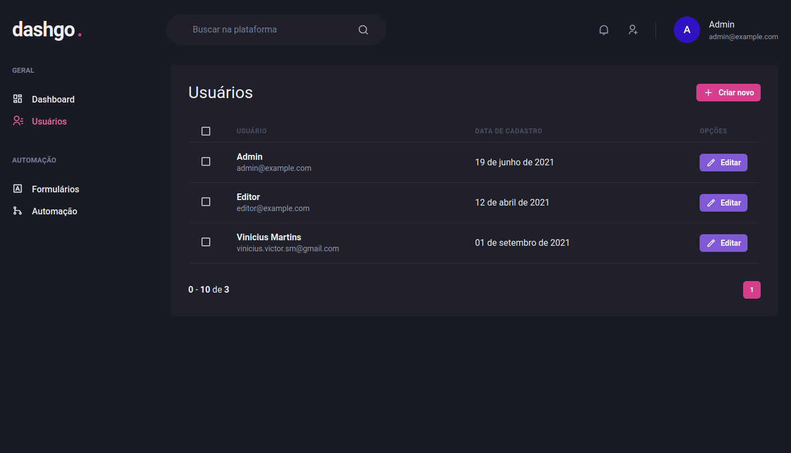

<div align="center">
  
</div>

<hr />
<br />

Dashgo is an application built on Ignite Bootcamp - Rocketseat. It's basically a web site app where you can: login, list and create users.

The app may appears to be simple, but it's not. Because, to build it we use the best, greatful and complex features/practices/resources.

## Built With

- [Nextjs](https://nextjs.org/)
- [Chakra UI](https://chakra-ui.com/)
- [React Query](https://react-query.tanstack.com/)
- [React Hook Form](https://react-hook-form.com/)
- [Yup](https://github.com/jquense/yup)
- [Nookies](https://github.com/maticzav/nookies)
- [Axios](https://github.com/axios/axios)
- [Apexcharts](https://apexcharts.com/)

## Getting Started

<br />

<div align="center">
<b>Before start, you will need to clone the api and run it on localhost:3333</b>

<br />

<b>Api repository:
  <a href="https://github.com/martinsvinicius/dashgo-auth-api">
  https://github.com/martinsvinicius/dashgo-auth-api</a>
</b>
</div>

<br />

**Now, you just need to install the project dependencies**

```sh
yarn install
```

**Then, you can run the app:**

```sh
yarn dev
```

Open http://localhost:3000 to view the app in the browser.
The server will reload if you make edit.

**That's it. You successfully started the app.**

## Usage

- Open http://localhost:3000

- Login with
  - email: admin@example.com
  - password: 123456

  or

  - email: editor@example.com
  - password: 123456

**The app has a permission system, so if you want to create a new user, you must login as admin.**

### Pages

- Login

  

- Dashboard (graphics data is fake)

  

- Users list

  

- Create users

  


## Author

<div align="center">
  

  <br />
  <b>Vinicius Martins</b>
  <hr />
  <br />

  
  <a href="https://www.twitter.com/martnght/">
    
  </a>
  <a href="mailto:vinicius.victor.sm@gmail.com">
    
  </a>
  <a href="https://www.linkedin.com/in/vinicius5g">
    
  </a>
</div>
